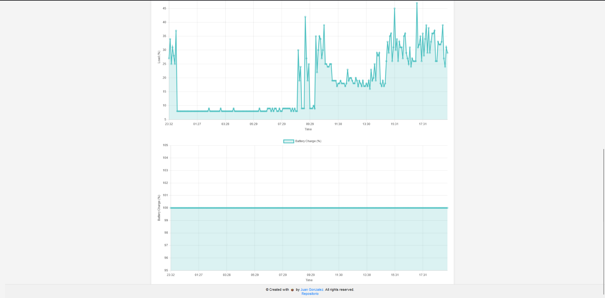

# Lyonn UPS Web status

[](https://t.me/Lyonn_UPS_bot) [](https://www.python.org) [](https://www.sqlite.org) [](https://networkupstools.org) [](https://www.proxmox.com) [](https://github.com/juanchixd/UPS_Lyonn_web) [](https://fastapi.tiangolo.com)

      

## Table of contents

- [Lyonn UPS Web status](#lyonn-ups-web-status)
  - [Table of contents](#table-of-contents)
  - [Introduction](#introduction)
  - [Demo](#demo)
  - [Screenshots](#screenshots)
  - [Feautures](#feautures)
  - [Requirements](#requirements)
  - [Development locally](#development-locally)
  - [Deploy on Vercel](#deploy-on-vercel)
  - [License](#license)
  - [Author](#author)
  - [Acknowledgments](#acknowledgments)

## Introduction


This project is a web application that allows you to check the voltage of the UPS, the battery level and the load of the UPS in real time and graphics of the last 24 hours. The information is collected from an API (created in another project [Bot_ups_Lyonn](https://github.com/juanchixd/Bot_ups_Lyonn)) and from a DB (in this case, from [Supabase](https://supabase.com/)).

The web application is created with [Flask](https://flask.palletsprojects.com/en/2.0.x/) and [Chart.js](https://www.chartjs.org/) and hosted on [Vercel](https://vercel.com/). However, it can be hosted on any other platform or on a local server.

## Demo

You can see a demo of the web application [here](https://ups.juangonzalez.com.ar/).

## Screenshots




## Feautures

- Real-time information
- Graphics of the last 24 hours
- Responsive design
- Easy to use
- Easy to deploy
- Easy to modify

## Requirements

- Python 3.6+
- Supabase account and table created
- API URL

## Development locally

To run the web application locally, you need to have Python installed. You can download it from [here](https://www.python.org/downloads/).

1. Clone the repository:

```bash
git clone https://github.com/juanchixd/UPS_Lyonn_web.git
```

2. Create a virtual environment:
This is optional, but it is recommended to avoid conflicts with the dependencies.

```bash
python -m venv venv
```

3. Install the dependencies:

```bash
pip install -r requirements.txt
```

4. Create a `.env` file with the following variables:

```bash
SUPABASE_URL=your_supabase_url
SUPABASE_KEY=your_supabase_key
API_URL=your_api_url
```

4. Run the application:

```bash
python app.py
```

5. Open your browser and go to `http://localhost:5000`.
6. Enjoy!

## Deploy on Vercel

To deploy the web application on Vercel, you need to have an account. You can create one [here](https://vercel.com/signup).

1. Clone the repository:

```bash
git clone https://github.com/juanchixd/UPS_Lyonn_web.git
```

2. Create a `.env` file in the root of the project with the following variables:

```bash
SUPABASE_URL=your_supabase_url
SUPABASE_KEY=your_supabase_key
API_URL=your_api_url
```

3. Install the Vercel CLI:

```bash
npm i -g vercel
```

4. Login to Vercel:

```bash
vercel login
```

5. Deploy the application:

```bash
vercel
```

6. You can see the application live at `https://your_project_name.vercel.app`.

## License

This project is licensed under the MIT License - see the [LICENSE](LICENSE) file for details.

## Author

- **Juan Gonzalez** - [juanchixd](https://github.com/juanchixd)

## Acknowledgments

- [Flask](https://flask.palletsprojects.com/en/2.0.x/)
- [Chart.js](https://www.chartjs.org/)
- [Vercel](https://vercel.com/)
- [Supabase](https://supabase.com/)
- [Bot_ups_Lyonn](https://github.com/juanchixd/Bot_ups_Lyonn)

```python
print("Thank you for reading my README.md!")
```

```python
# Lyonn UPS Web status - developed by Juan Gonzalez
```
